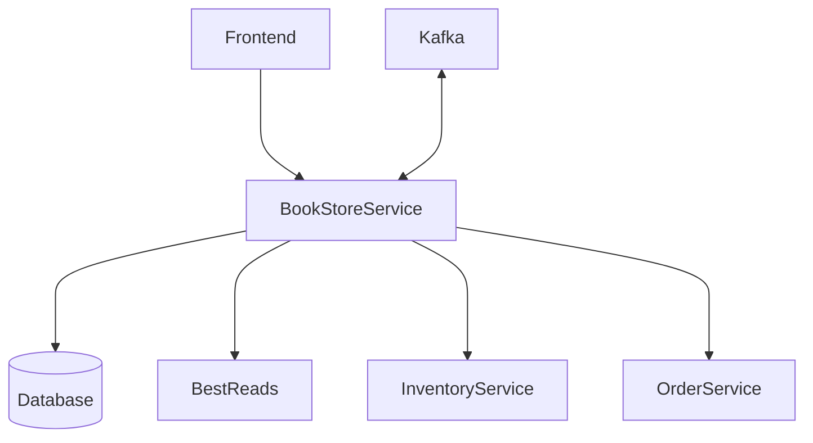

# JavaZone Presentation Project - 2024

_Test more and better with less friction!_

<!--toc:start-->
- [JavaZone Presentation Project - 2024](#javazone-presentation-project-2024)
    - [Description](#description)
      - [Package Overview](#package-overview)
      - [Overall architecture](#overall-architecture)
      - [Test related tools used in the project](#test-related-tools-used-in-the-project)
    - [Requirements](#requirements)
    - [Build](#build)
    - [Running tests](#running-tests)
<!--toc:end-->

### Description

This project is based on a talk I did at JavaZone 2024.
 - Slides can be downloaded here: [Javazone.pptx](./Javazone.pptx).
 - The talk can be watched on my website ([https://lindbakk.com/blog/modern-testing-test-more-and-better-with-less-friction-talk-javazone-2024](https://lindbakk.com/blog/modern-testing-test-more-and-better-with-less-friction-talk-javazone-2024)) or Vimeo ([https://vimeo.com/showcase/11348501/video/1006510177](https://vimeo.com/showcase/11348501/video/1006510177))

#### Package Overview

- Web: Contains the web API
- Service: Contains "Domain logic" and ties the system together
- Persistence: Contains everything related to databases, including database entities
- Integration: The code related to integrating with other web services
- External_orderservice: Would normally not be here. Just exists to generate contract test stubs.

#### Overall architecture

In this fictional system we have multiple dependencies:

- BookStoreService: This service :)
- InventoryService: Responsible to keep track of inventory - I.e. whether we have a book ready for sale or whether we
  need to order new copies.
- OrderService: Keeps track of the book orders.
- BestReads: A fictional third-party service that has an API to provide review scores.
- Database: The BookService's SQL database.
- BookStoreService also consumes and produces Kafka messages.

#### Test related tools used in the project

- [Spring Cloud Contract](https://spring.io/projects/spring-cloud-contract): Used to write contracts and generate
  contract tests.
- [TestContainers](https://testcontainers.com/): Used to spin up dependencies, such as Postgresql.
- [ApprovalTests](https://approvaltests.com/): Simplifies validating returns from APIs - especially for larger
  responses.
- [AssertJ](https://assertj.github.io/doc/): More expressive and easier asserts.
- [MockServer](https://mock-server.com/): Makes it easy to mock calls to external service.
- [Awaitility](http://www.awaitility.org/): Nifty little tool that makes it easy to "wait for some condition" before
  letting a test progress.

### Requirements

- Java 21+
- Gradle
- [Docker-API compatible container runtime](https://java.testcontainers.org/supported_docker_environment/)

### Build

'gradle build'

### Running tests

'gradle test'
